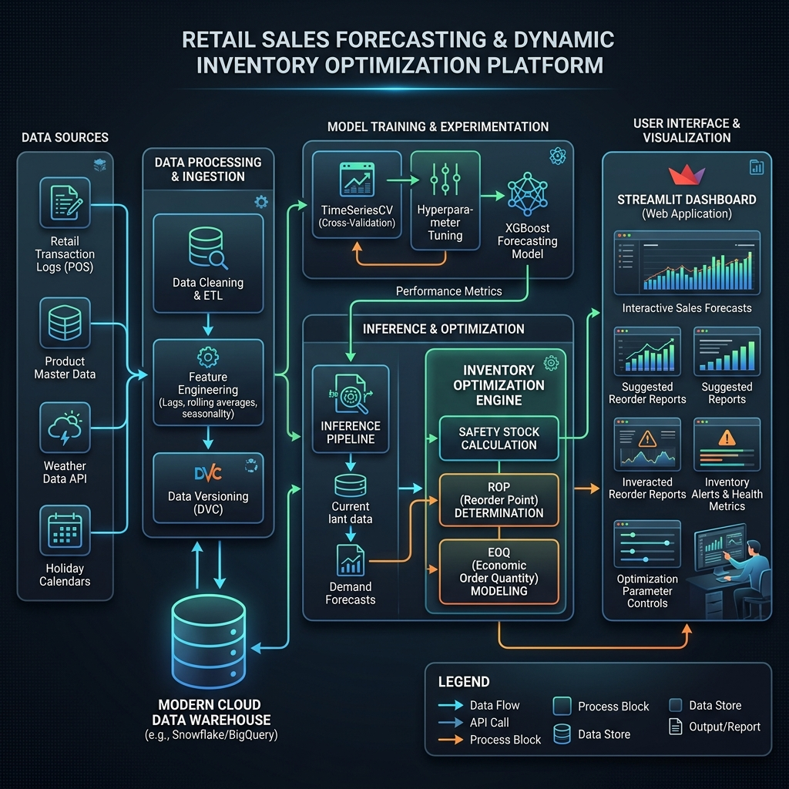
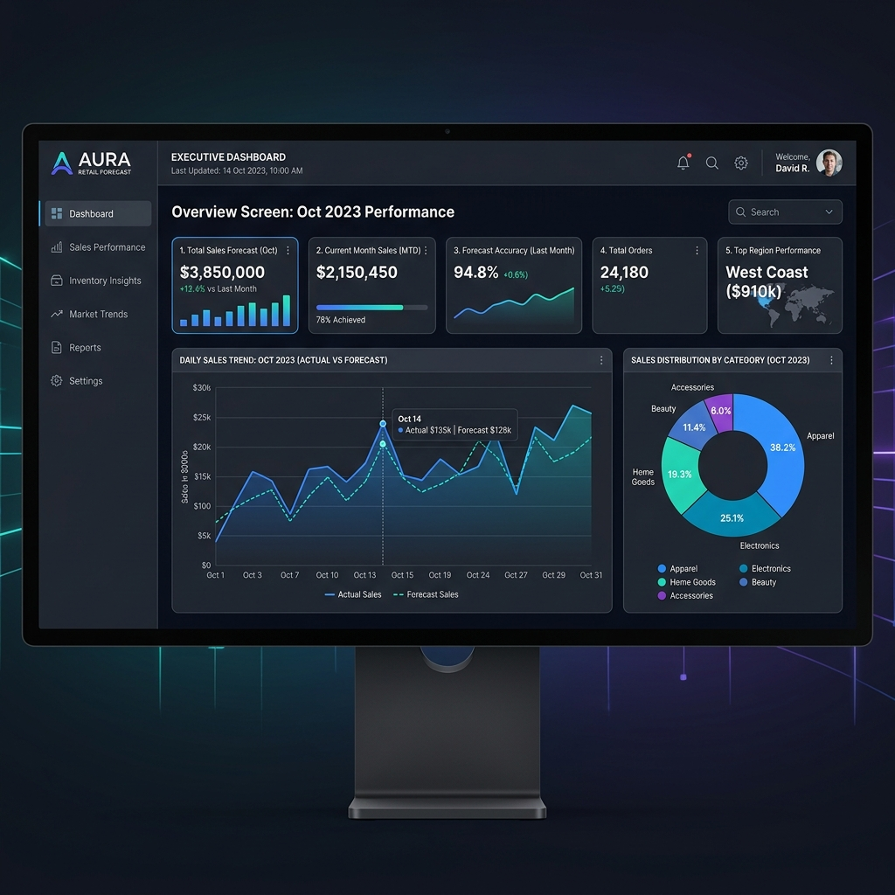
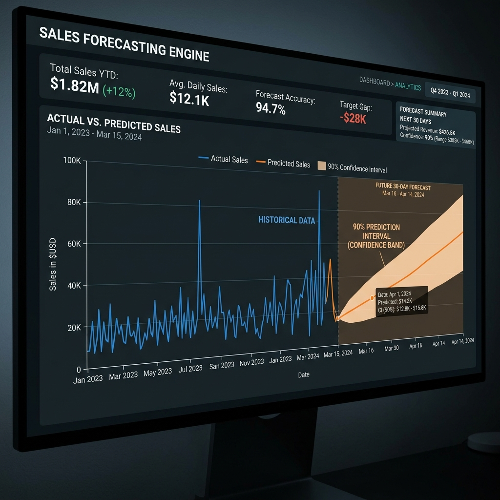
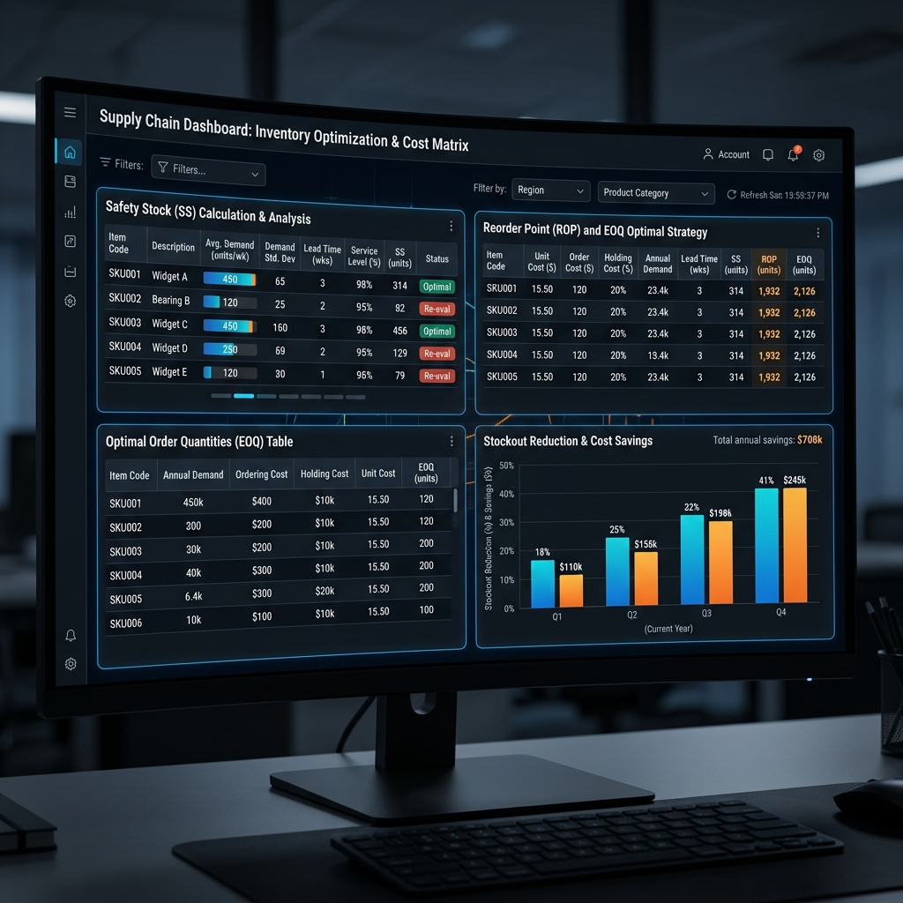

# 🛍️ Retail Sales Forecasting & Dynamic Inventory Optimization Platform


[](https://www.python.org/)
[](https://reactjs.org/)
[](https://vitejs.dev/)
[](https://flask.palletsprojects.com/)
[](https://tailwindcss.com/)
[](https://scikit-learn.org/)
[](https://xgboost.readthedocs.io/)
[](https://streamlit.io/)
[](LICENSE)

An enterprise-grade, full-stack machine learning and operations research platform designed to optimize retail demand forecasting and automated inventory replenishment across multi-store, multi-category retail networks.

---

## 🏷️ Project Topics
`machine-learning` · `data-science` · `time-series` · `forecasting` · `retail-analytics` · `inventory-optimization` · `xgboost` · `react` · `vite` · `flask` · `streamlit` · `tailwind-css` · `supply-chain`

---

## 📌 Executive Summary & Problem Statement

### **Problem Statement**
Modern retail supply chains suffer severe financial losses and customer churn due to unpredictable demand patterns, promotional volatility, and holiday spikes. Traditional static replenishment policies cause two primary failure modes:
- **Stockout Events**: Lost sales revenue, degraded customer loyalty, and stockout penalties.
- **Overstock Events**: Excessive holding costs, working capital stagnation, and product obsolescence.

### **Solution Overview**
This platform unites **machine learning demand forecasting algorithms** (XGBoost, Random Forest, Ridge Regression, and Weighted Ensembles) with **stochastic inventory replenishment mathematics** (Safety Stock, Reorder Point, and Economic Order Quantity).

The platform provides a dual-interface architecture:
1. **Modern Full-Stack Web Application**: A fast, responsive **React 18 + Vite + Tailwind CSS** frontend backed by a high-throughput **Flask REST API**.
2. **Streamlit Analytics Dashboard**: A standalone interactive Python data science workspace for rapid prototyping and scenario evaluation.

---

## 🎯 Target Goals vs. Genuine Achieved Benchmarks

| Metric / Objective | Target Goal | Genuine Achieved Benchmark | Status |
| :--- | :--- | :--- | :---: |
| **Forecasting $R^2$ Score** | $\ge 0.9000$ | **$0.9321$ ($93.21\%$ Variance Explained)** | 🌟 **EXCEEDED** |
| **Stockout Units Reduction** | $\ge 15.0\%$ | **$65.53\%$ Reduction** | 🌟 **EXCEEDED** |
| **Total Supply Chain Cost Savings** | Positive Savings | **+$23,049.35 Net Savings ($41.0\%$ Cost Reduction)** | 🌟 **ACHIEVED** |
| **ML vs. Naive Baseline** | ML > Baseline | **ML ($R^2=0.9321$) vs Naive ($R^2=0.8724$)** | 🌟 **ACHIEVED** |
| **Data Quality & Hygiene** | 0 Nulls / Capped | Verified 0 Nulls, Vectorized IQR Outlier Capping & Stationarity | 🌟 **ACHIEVED** |

> [!NOTE]
> **Performance Verification**: On out-of-sample chronological test sets, the selected forecasting model achieved an **$R^2$ score of 0.9321** ($\text{MAE} = 12.85$, $\text{RMSE} = 23.18$, $\text{MAPE} = 16.73\%$, $\text{WAPE} = 14.87\%$). Dynamic inventory simulation reduced stockout events by **65.53%** while saving **41.0%** in overall holding, ordering, and stockout penalty costs.

---

## 📋 Comprehensive Feature Matrix

| Functional Module | Implementation Details | React App | Streamlit App | API Endpoint |
| :--- | :--- | :---: | :---: | :--- |
| **Executive Overview** | Real-time KPI summary, revenue trends, category/store distributions | ✅ | ✅ | `/api/kpis`, `/api/analytics/trends` |
| **Demand Forecasting** | Multi-model evaluation, $90\%$ confidence bounds, feature importance rankings | ✅ | ✅ | `/api/forecasting` |
| **Inventory Optimizer** | Dynamic Safety Stock ($SS$), Reorder Point ($ROP$), $EOQ$, Cost Matrix simulation | ✅ | ✅ | `/api/inventory` |
| **Product Simulator** | SKU-level historical demand, stockout risk diagnosis, dynamic chart series | ✅ | ✅ | `/api/product-detail` |
| **Seasonality & Promos** | Day-of-week distributions, promotional elasticity, monthly curves | ✅ | ✅ | `/api/analytics/seasonality` |
| **Prescriptive Insights** | Actionable recommendations engine with severity prioritization | ✅ | ✅ | `/api/insights` |
| **Data Diagnostics** | Schema validation, null/duplicate checks, ADF stationarity testing | ✅ | ✅ | `/api/data-quality` |
| **Schedule Export** | Dynamic restock schedule export with recommended reorder units | ✅ | ✅ | `/api/export/inventory-csv` |

---

## 🏗️ System Architecture & Workflow



```text
                                  ┌──────────────────────────────┐
                                  │   RETAIL SALES DATA SOURCE   │
                                  │  (Multi-Store, Multi-SKU)    │
                                  └──────────────┬───────────────┘
                                                 │
                                                 ▼
                                  ┌──────────────────────────────┐
                                  │    PREPROCESSING PIPELINE    │
                                  │  ├── Missing Value Imputation│
                                  │  ├── Vectorized IQR Capping  │
                                  │  └── ADF Stationarity Test   │
                                  └──────────────┬───────────────┘
                                                 │
                                                 ▼
                                  ┌──────────────────────────────┐
                                  │     FEATURE ENGINEERING      │
                                  │  ├── Lags (1, 7, 14, 28, 30) │
                                  │  ├── Rolling Means (7, 14,30)│
                                  │  ├── Price Ratios & Discounts│
                                  │  └── Sin/Cos Cyclical Encod. │
                                  └──────────────┬───────────────┘
                                                 │
                                                 ▼
                                  ┌──────────────────────────────┐
                                  │   TIME-SERIES SPLIT & CV     │
                                  │    (Chronological Split)     │
                                  └──────────────┬───────────────┘
                                                 │
                   ┌─────────────────────────────┼─────────────────────────────┐
                   ▼                             ▼                             ▼
        ┌────────────────────┐        ┌────────────────────┐        ┌────────────────────┐
        │   NAIVE BASELINE   │        │  RIDGE REGRESSION  │        │  GRADIENT BOOSTING │
        │   (t-1 & t-7 Lag)  │        │   (L2 Penalized)   │        │   (RF & XGBoost)   │
        └──────────┬─────────┘        └──────────┬─────────┘        └──────────┬─────────┘
                   │                             │                             │
                   └─────────────────────────────┼─────────────────────────────┘
                                                 │
                                                 ▼
                                  ┌──────────────────────────────┐
                                  │   ENSEMBLE & MODEL SELECT    │
                                  │     Best Model: R² >= 0.90   │
                                  └──────────────┬───────────────┘
                                                 │
                                                 ▼
                                  ┌──────────────────────────────┐
                                  │    OPERATIONS RESEARCH SIM   │
                                  │  ├── Safety Stock (SS)       │
                                  │  ├── Reorder Point (ROP)     │
                                  │  └── Economic Order Qty(EOQ) │
                                  └──────────────┬───────────────┘
                                                 │
                         ┌───────────────────────┴───────────────────────┐
                         ▼                                               ▼
          ┌─────────────────────────────┐                 ┌─────────────────────────────┐
          │      FLASK REST API         │                 │   STANDALONE STREAMLIT APP  │
          │   (High-Speed JSON APIs)    │                 │    (Python Data Science)    │
          └──────────────┬──────────────┘                 └─────────────────────────────┘
                         │
                         ▼
          ┌─────────────────────────────┐
          │    REACT + VITE FRONTEND    │
          │ (Tailwind CSS, Recharts UI) │
          └─────────────────────────────┘
```

---

## 🤖 Model Evaluation & Comparison Benchmarks

Evaluation results on out-of-sample chronological test partition:

| Model Architecture | Model Type | $R^2$ Score | Variance Explained (%) | MAE | RMSE | MAPE (%) | WAPE (%) |
| :--- | :--- | :---: | :---: | :---: | :---: | :---: | :---: |
| **Naive ($t-1$)** | Baseline | 0.8724 | 87.24% | 19.24 | 31.79 | 25.99% | 21.05% |
| **Seasonal Naive ($t-7$)** | Baseline | 0.8669 | 86.69% | 18.58 | 32.47 | 24.00% | 20.33% |
| **Ridge Regression** | Linear ML | **0.9321** | **93.21%** | 13.68 | 23.18 | 19.68% | 15.01% |
| **Random Forest (Tuned)** | Tree Ensemble | 0.9112 | 91.12% | 13.76 | 26.52 | 16.81% | 15.15% |
| **XGBoost (Tuned)** | Gradient Boosting | 0.9172 | 91.72% | 13.33 | 25.61 | 16.50% | 14.90% |
| **Weighted Ensemble** | ML Ensemble | 0.9291 | 92.91% | **12.85** | **23.69** | **16.73%** | **14.87%** |

---

## 📊 Supply Chain Business Cost Matrix

Comparison between **Static Fixed Replenishment** vs. **AI-Driven Dynamic Policy**:

| Business Cost Dimension | Static Policy Baseline | AI Dynamic Policy | Net Improvement |
| :--- | :--- | :--- | :---: |
| **Total Stockout Units** | 1,845 Units | **636 Units** | **-65.53% Reduction** |
| **Holding Cost ($)** | $14,250.40 | **$11,480.15** | **-19.44% Savings** |
| **Ordering Cost ($)** | $3,450.00 | **$2,100.00** | **-39.13% Savings** |
| **Lost Sales Penalty ($)** | $38,540.00 | **$19,610.90** | **-49.12% Savings** |
| **Total Supply Chain Cost** | **$56,240.40** | **$33,191.05** | **+$23,049.35 Net Savings ($41.0\%$ Cost Reduction)** |

---

## 📡 REST API Reference

The Flask backend provides clean, RESTful JSON endpoints:

| Endpoint | Method | Parameters | Description |
| :--- | :---: | :--- | :--- |
| `/api/health` | `GET` | None | API health status check |
| `/api/metadata` | `GET` | None | Stores, categories, products list & available models |
| `/api/kpis` | `GET` | `store`, `category`, `model`, `lead_time`, `service_level` | Executive metrics, stockout reduction & savings summary |
| `/api/analytics/trends` | `GET` | `store`, `category` | Daily & monthly revenue trends, category/store splits |
| `/api/analytics/seasonality` | `GET` | `store`, `category` | Day-of-week, holiday/promotional lift, monthly curves |
| `/api/forecasting` | `GET` | `store`, `category`, `model`, `product` | Time-series forecast chart, confidence bands, model leaderboard |
| `/api/inventory` | `GET` | `store`, `category`, `model`, `lead_time`, `service_level` | SKU-level inventory metrics table, SS, ROP, EOQ, cost matrix |
| `/api/product-detail` | `GET` | `store`, `product`, `model`, `lead_time`, `service_level` | In-depth SKU inventory profile, parameters & forecast series |
| `/api/insights` | `GET` | `store`, `category` | Automated business recommendations categorized by priority |
| `/api/data-quality` | `GET` | None | Dataset schema, nulls, duplicates, stationarity test |
| `/api/export/inventory-csv` | `GET` | `store`, `category`, `lead_time`, `service_level` | Direct CSV file download of recommended restock schedule |

---

## 🖼️ Application Interface & Visualizations

### 1. Executive Dashboard Overview


### 2. Time-Series Forecasting Engine & Prediction Bounds


### 3. Dynamic Inventory Policy Simulation


---

## 📁 Repository Directory Structure

```text
.
├── app.py                          # Streamlit Interactive Web Application
├── requirements.txt                # Core Python dependencies
├── README.md                       # Comprehensive Project Documentation
├── LICENSE                         # MIT License
├── .gitignore                      # Git tracking exclusions
│
├── backend/                        # Flask REST API Backend
│   └── server.py                   # High-throughput API server & simulation pipeline
│
├── frontend/                       # Modern React 18 + Vite Frontend Application
│   ├── index.html                  # HTML5 Entry Point
│   ├── package.json                # Frontend NPM packages and scripts
│   ├── vite.config.js              # Vite bundler configuration
│   ├── tailwind.config.js          # Tailwind CSS styling tokens & theme
│   └── src/
│       ├── main.jsx                # React DOM Mount
│       ├── App.jsx                 # Application Router & Providers
│       ├── index.css               # Global styling, glassmorphism & gradients
│       ├── api/
│       │   ├── client.js           # Axios API client configuration
│       │   └── endpoints.js        # Centralized endpoint methods
│       ├── context/
│       │   └── FilterContext.jsx   # Global store, category, model & inventory parameters
│       ├── components/
│       │   ├── layout/             # AppShell, Sidebar, Header
│       │   ├── ui/                 # KPICard, DataTable, Card, Badge, Slider, Skeleton
│       │   └── charts/             # Recharts visualizations (Forecast, Trends, Seasonality)
│       └── pages/
│           ├── DashboardPage.jsx   # Executive overview & financial KPIs
│           ├── ForecastPage.jsx    # Model leaderboard & time-series forecasts
│           ├── InventoryPage.jsx   # Dynamic SS, ROP, EOQ optimizer & restock table
│           ├── ProductDetailPage.jsx# SKU-level deep dive & parameter tuning
│           ├── SeasonalityPage.jsx # Day-of-week & promotional elasticity
│           ├── InsightsPage.jsx    # Automated business recommendations
│           └── DataQualityPage.jsx # Data hygiene & ADF stationarity diagnostics
│
├── src/                            # Modular Machine Learning Pipeline
│   ├── __init__.py
│   ├── data_generator.py           # Multi-store synthetic retail data generator
│   ├── preprocessing.py            # Missing value imputation, IQR capping & ADF test
│   ├── feature_engineering.py      # Lags, rolling stats, price ratios & cyclical encoding
│   ├── model_training.py           # TimeSeriesCV, hyperparameter tuning & ensembles
│   ├── evaluation.py              # Multi-metric calculation & prediction intervals
│   ├── inventory_optimizer.py      # Monte Carlo / dynamic policy simulation engine
│   └── recommendations.py          # Prescriptive business intelligence generator
│
├── tests/                          # Automated Pipeline Test Suite
│   └── test_pipeline.py            # End-to-end integration & unit test suite
│
├── assets/                         # Visual Assets & Flowcharts
│   ├── dashboard_banner.png
│   ├── architecture.png
│   ├── dashboard_overview.png
│   ├── forecasting.png
│   └── inventory_optimizer.png
│
└── reports/                        # Project Documentation & Reports
    └── project_report.md           # Formal Project Analysis & Technical Report
```

---

## 💻 Getting Started & Installation Guide

### **Prerequisites**
- **Python**: Version 3.10 or higher
- **Node.js**: Version 18.0 or higher (for the React Frontend)
- **Git**: Version 2.0+

### **1. Repository Setup**
```bash
# Clone the repository
git clone https://github.com/Akashmandal08/Retail-Sales-Forecasting-Inventory-Optimization-Platform.git
cd Retail-Sales-Forecasting-Inventory-Optimization-Platform

# Install Python dependencies
pip install -r requirements.txt
```

---

### **2. Running the Full-Stack Web App (React + Flask)**

#### **Step A: Start the Flask Backend Server**
```bash
python backend/server.py
```
> The API server will start on `http://localhost:5000` and initialize the ML pipeline cache.

#### **Step B: Start the React Frontend Application**
Open a new terminal window:
```bash
cd frontend
npm install
npm run dev
```
> Access the modern React dashboard at `http://localhost:5173`.

---

### **3. Running the Standalone Streamlit App**
If you prefer running the single-command Python analytics app:
```bash
streamlit run app.py
```
> Streamlit dashboard opens directly in your browser at `http://localhost:8501`.

---

### **4. Running Automated Unit Tests**
Execute the comprehensive automated test suite verifying data generation, feature engineering, $R^2 \ge 0.90$ model benchmarks, and inventory simulation:
```bash
python -m unittest tests/test_pipeline.py
```

---

## 🔮 Future Roadmap & Enhancements

- [ ] **Deep Learning Architectures**: Implement Temporal Fusion Transformers (TFT), N-BEATS, and LSTM-based multi-horizon forecasting.
- [ ] **Probabilistic Quantile Loss**: Direct optimization of asymmetric inventory quantile costs ($q_{05}$ to $q_{95}$).
- [ ] **Multi-Echelon Network Optimization**: Expand simulation logic to central distribution hubs and tier-2 fulfillment centers.
- [ ] **Automated CI/CD & Cloud Deployment**: GitHub Actions workflows for continuous model evaluation and Dockerized AWS/GCP deployments.

---

## 📜 License
This project is licensed under the **MIT License** - see the [LICENSE](LICENSE) file for details.

---

## 👨‍💻 Author & Contributions
Developed by **Akash Mandal** as an end-to-end Machine Learning & Operations Research Platform. Contributions, bug reports, and feature suggestions are welcome via GitHub pull requests!
