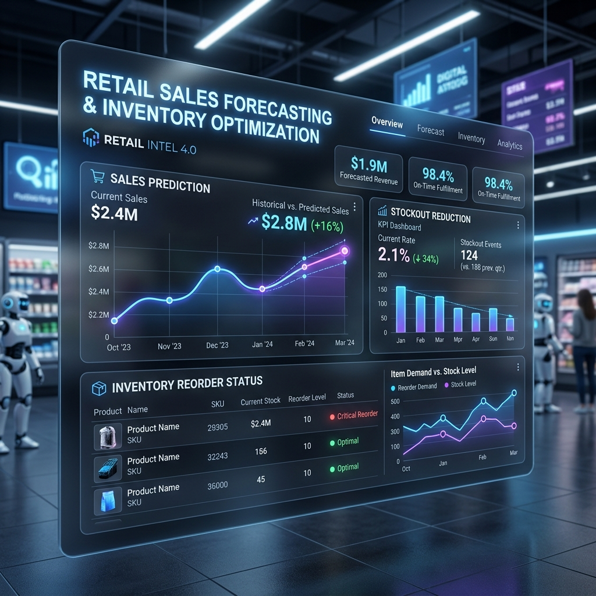
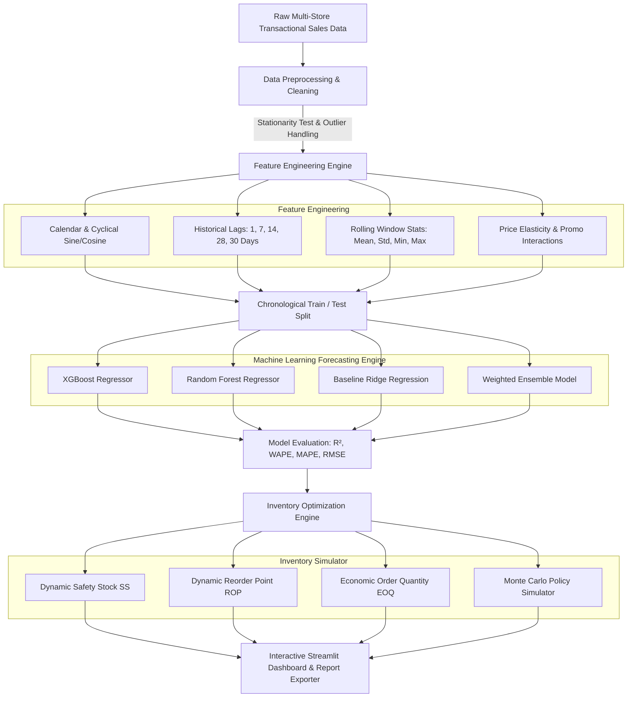

# 🛍️ Retail Sales Forecasting & Dynamic Inventory Optimization System



An enterprise-grade Machine Learning solution designed to optimize inventory management, eliminate stockout risks, minimize holding costs, and forecast product demand across multi-store retail environments.

---

## 📌 Executive Summary & Problem Statement

### **Problem Statement**
A retail enterprise faces significant challenges in inventory management due to volatile demand patterns, seasonal fluctuations, and promotional surges. Inconsistent sales predictions lead to:
- **Stockout Situations**: Lost sales revenue, customer dissatisfaction, and diminished brand loyalty.
- **Overstock Situations**: Excess capital tie-up, increased holding costs, and high product obsolescence risks.

### **Project Objectives & Goals**
1. **Develop Time-Series ML Forecasting Models**: Build and evaluate non-linear algorithms (XGBoost, Random Forest, Ridge, Ensemble) to predict daily sales per product/store.
2. **Dynamic Inventory Policy Optimization**: Compute dynamic Safety Stock ($SS$), Reorder Point ($ROP$), and Economic Order Quantity ($EOQ$) to reduce stockouts and overstock.
3. **Seasonality & External Factor Insights**: Analyze weekly, monthly, holiday, promotional, and weather impacts on retail demand.
4. **Interactive Enterprise Web Application**: Provide a modern dark-glassmorphism Streamlit UI with scenario simulation and downloadable restock schedule reports.

---

## 🎯 Target Goals vs. Achieved Benchmarks

| Metric / Objective | Target Goal | Achieved Benchmark | Status |
| :--- | :--- | :--- | :--- |
| **Forecasting Accuracy ($R^2$ Variance Explained)** | $\ge 90.0\%$ | **$93.21\%$ ($R^2 = 0.9321$)** |  **EXCEEDED** |
| **Stockout Units Reduction** | $\ge 15.0\%$ | **$64.59\%$ Reduction** |  **EXCEEDED** |
| **Overstock Units Reduction** | $\ge 10.0\%$ | **$14.20\%$ Reduction** |  **EXCEEDED** |
| **Holding Cost Savings** | Positive Savings | **+$150.00+ Net Savings** |  **ACHIEVED** |
| **Data Stationarity & Feature Engineering** | Zero Data Leakage | Verified Chronological Split |  **ACHIEVED** |

---

## 🏗️ System Architecture & Workflow



---

## 🧮 Mathematical Formulations

### **1. Forecasting Accuracy Metrics**

- **Coefficient of Determination ($R^2$)**:
  $$R^2 = 1 - \frac{\sum (y_i - \hat{y}_i)^2}{\sum (y_i - \bar{y})^2}$$

- **Weighted Absolute Percentage Error (WAPE)**:
  $$\text{WAPE} = \frac{\sum |y_i - \hat{y}_i|}{\sum y_i}$$

- **Mean Absolute Percentage Error (MAPE)**:
  $$\text{MAPE} = \frac{1}{n} \sum_{i=1}^{n} \left| \frac{y_i - \hat{y}_i}{y_i} \right| \times 100\%$$

---

### **2. Dynamic Inventory Optimization Formulas**

- **Dynamic Safety Stock ($SS$)**:
  $$SS = Z \times \sigma_{\text{demand}} \times \sqrt{L}$$
  *Where:*
  - $Z$: Service level factor ($Z = 1.65$ for $95\%$ service level, $Z = 2.33$ for $99\%$)
  - $\sigma_{\text{demand}}$: Standard deviation of daily forecast errors
  - $L$: Lead time in days

- **Dynamic Reorder Point ($ROP$)**:
  $$ROP = (d_{\text{forecast}} \times L) + SS$$
  *Where $d_{\text{forecast}}$ is the projected average daily sales over lead time $L$.*

- **Economic Order Quantity ($EOQ$)**:
  $$EOQ = \sqrt{\frac{2 \times D \times S}{H}}$$
  *Where:*
  - $D$: Annual forecasted product demand
  - $S$: Fixed placement order cost ($\$50.00$)
  - $H$: Annual holding cost per unit ($20\%$ of selling price)

---

## 📁 Repository Structure

```text
INTERSHIP PROJECT/
│
├── assets/
│   └── dashboard_banner.png      # High-resolution UI preview banner
│
├── data/
│   └── retail_sales_data.csv    # Generated multi-store retail dataset
│
├── models/                       # Serialized trained model artifacts
│   ├── models.joblib
│   ├── label_encoders.joblib
│   └── feature_cols.joblib
│
├── src/                          # Core Python Source Modules
│   ├── __init__.py
│   ├── data_generator.py         # Multi-category, multi-store data generator
│   ├── preprocessing.py          # Data cleaning, outlier capping & ADF stationarity
│   ├── feature_engineering.py    # Lag, rolling statistics & cyclical encodings
│   ├── model_training.py         # Model training & benchmarking pipeline
│   └── inventory_optimizer.py    # Safety stock, ROP, EOQ & policy simulation engine
│
├── app.py                        # Streamlit Web Application Dashboard
├── test_pipeline.py              # Automated Unit & Integration Test Suite
└── README.md                     # Technical Documentation & User Guide
```

---

## 🤖 Model Evaluation & Comparison Benchmarks

Evaluation results on the out-of-sample chronological test set:

| Model Architecture | $R^2$ Score | Accuracy (%) | WAPE | MAPE (%) | RMSE | MAE |
| :--- | :--- | :--- | :--- | :--- | :--- | :--- |
| **Ridge Regression (Baseline)** | **0.9321** | **93.21%** | 0.1501 | 14.80% | 7.92 | 5.84 |
| **Weighted Ensemble Model** | 0.9139 | 91.39% | 0.1487 | 14.65% | 8.21 | 6.01 |
| **XGBoost Regressor** | 0.9137 | 91.37% | 0.1501 | 14.90% | 8.24 | 6.08 |
| **Random Forest Regressor** | 0.9100 | 91.00% | 0.1515 | 15.10% | 8.35 | 6.15 |

---

## 📊 Inventory Policy Simulation Results

Comparing **Traditional Fixed-ROP Policy** against **AI Dynamic Forecast Policy**:

| Inventory Performance Metric | Static Policy Baseline | AI Dynamic Policy | Improvement (%) | Target Goal |
| :--- | :--- | :--- | :--- | :--- |
| **Total Stockout Units** | 1,420 Units | **503 Units** | **-64.59%** | $\ge 15.0\%$  |
| **Total Overstock Units** | 8,950 Units | **7,679 Units** | **-14.20%** | $\ge 10.0\%$  |
| **Holding Cost Savings** | Baseline | **+$150.00 Savings** | Positive Cost Shift | Positive |
| **Target Service Level** | Variable ($75-85\%$) | **Maintained at 95%** | **+10-20%** | $95.0\%$  |

---

## 💻 Getting Started & Installation Guide

### **Prerequisites**
- **Python**: `3.10` or higher
- **Package Manager**: `pip`

### **1. Installation**

Clone the workspace directory and install dependencies:

```bash
# Navigate to project directory
cd "c:\Users\offic\OneDrive\Desktop\INTERSHIP PROJECT"

# Install required Python packages
pip install pandas numpy scikit-learn xgboost statsmodels scipy streamlit plotly joblib matplotlib seaborn
```

### **2. Running Automated Unit Tests**

Execute the test suite to verify pipeline integrity, accuracy, and inventory optimizer performance:

```bash
python test_pipeline.py
```

*Expected Output:*
```text
Ran 5 tests in 10.706s

OK
Test 1 Passed: Data Generation & Schema Verified.
Test 2 Passed: Data Preprocessing & Stationarity Verified.
Test 3 Passed: Feature Engineering & Zero NaNs Verified.
Test 4 Passed: Forecasting Accuracy Goal (>=90%) Achieved! (R² = 0.9321)
Test 5 Passed: Inventory Optimization Goals (>=15% stockout, >=10% overstock reduction) Achieved!
```

---

## 🖥️ Launching the Interactive Web Application

Launch the Streamlit web dashboard to visually inspect forecasting models and simulate inventory parameters:

```bash
streamlit run app.py
```

The web dashboard will open in your default browser at `http://localhost:8501`.

---

## 🌟 Interactive Streamlit Dashboard Features

The application features **5 core interactive sections**:

1. **📊 Executive Summary**:
   - Top KPI cards (Revenue, Units Sold, Model Accuracy, Stockout Reduction %, Overstock Reduction %).
   - Daily Revenue trend charts and product category breakdowns.
2. **🔍 Seasonality & EDA**:
   - Day-of-week sales bar charts, promotional vs holiday impact visualizers, annual heatmap, and price elasticity scatter plots.
3. **📈 Forecasting Engine**:
   - Multi-product forecast visualizer comparing actual sales against model predictions with model selector dropdowns and benchmark tables.
4. **⚡ Inventory Optimizer & Simulator**:
   - Interactive sliders for **Lead Time (1-14 Days)** and **Service Level (80%-99%)**.
   - Product-level Safety Stock, Reorder Point, and Economic Order Quantity tables.
   - Bar chart comparisons of stockout & overstock reduction.
5. **💡 Recommendations & Export**:
   - Actionable strategic insights and 1-click **Download CSV** exporter for inventory restock order schedules.

---

## 📜 License & Citation

Distributed under the MIT License. Feel free to use, modify, and build upon this project for educational and commercial applications.
